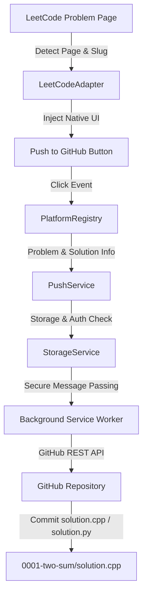

# ⚡ CodeSync — Multi-Platform Coding Solution → GitHub Chrome Extension

> **Seamlessly sync your LeetCode and competitive programming solutions to GitHub with a single click.**

CodeSync is a production-quality Google Chrome Extension (Manifest V3) built with React, TypeScript, and Vite. It detects when you are solving problems on supported platforms (starting with LeetCode) and injects a native **"🚀 Push to GitHub"** button that synchronizes your solution, creates properly organized repositories, and commits files without interrupting your coding flow.

---

## 🏗 Architecture & Flow



### Modular Directory Structure

```text
codesync/
│
├── src/
│   ├── background/
│   │   └── background.ts            # Manifest V3 background service worker
│   │
│   ├── content/
│   │   ├── common/
│   │   │   └── content-utils.ts     # DOM helpers, observer, and SPA router detection
│   │   │
│   │   └── platforms/
│   │       └── leetcode/
│   │           ├── leetcode-adapter.ts   # PlatformAdapter implementation for LeetCode
│   │           ├── leetcode-detector.ts  # URL & problem extraction logic
│   │           ├── leetcode-ui.ts        # Dynamic DOM injection & button rendering
│   │           └── leetcode.css          # Injected button and toast styling
│   │
│   ├── github/
│   │   ├── github-client.ts         # GitHub REST API client abstraction
│   │   ├── github-repository.ts     # Repository creation & verification
│   │   └── github-files.ts          # Path building & filename mapping
│   │
│   ├── platforms/
│   │   ├── platform-adapter.ts      # Generic PlatformAdapter interface
│   │   └── platform-registry.ts     # Multi-platform registry manager
│   │
│   ├── popup/
│   │   ├── App.tsx                  # Extension popup UI
│   │   ├── App.css                  # Dark glassmorphic styling
│   │   └── components/
│   │       ├── Header.tsx           # Status badge & logo
│   │       └── PlatformList.tsx     # Active & upcoming platforms list
│   │
│   ├── options/
│   │   ├── Options.tsx              # Settings & token configuration page
│   │   └── Options.css              # Options styling
│   │
│   ├── storage/
│   │   └── storage.ts               # chrome.storage.sync & chrome.storage.local wrapper
│   │
│   ├── types/
│   │   └── index.ts                 # ProblemInfo, SolutionInfo, and configuration types
│   │
│   └── main.tsx
│
├── public/
│   └── icons/                       # Extension icons (16px, 48px, 128px)
├── tests/
│   └── github-files.test.js         # Pure logic tests (paths, slug sanitization, languages)
├── manifest.json                    # Manifest V3 specification
├── package.json
├── tsconfig.json
├── vite.config.ts
└── README.md
```

---

## 🚀 Tech Stack

- **Framework**: Chrome Extension Manifest V3
- **Language**: TypeScript 5.x
- **Build System**: Vite 6.x + `@crxjs/vite-plugin`
- **UI Layer**: React 18
- **Styles**: Custom Vanilla CSS with dark glassmorphic design and CSS variables
- **Testing**: Node.js Native Test Runner (`node:test`)

---

## 🛠 Local Development & Installation

### 1. Prerequisites
- Node.js (v18 or newer recommended, tested on v24)
- Google Chrome (or Chromium-based browser)

### 2. Install Dependencies
```bash
npm install
```

### 3. Build Extension
```bash
npm run build
```
This produces a ready-to-load extension directory in `dist/`.

### 4. Run Unit Tests
```bash
npm test
```

### 5. Load into Google Chrome
1. Open Google Chrome and navigate to `chrome://extensions`.
2. Toggle **Developer mode** in the top-right corner.
3. Click **Load unpacked**.
4. Select the `dist/` directory inside this project (`c:\Users\MANISH\OneDrive\Desktop\Ext\dist`).
5. The **CodeSync - Push to GitHub** extension is now active!

---

## 🎯 How It Works in Phase 1

1. Open any problem on LeetCode (e.g. `https://leetcode.com/problems/two-sum/`).
2. The extension's content script detects the LeetCode problem URL and hooks into the DOM.
3. A native-styled **"🚀 Push to GitHub"** button is injected right next to LeetCode's "Submit" button in the action bar (with a fallback floating button if the action bar is collapsed).
4. Navigating between problems via LeetCode's SPA router dynamically detects the new problem and refreshes the button without requiring a browser refresh.
5. Clicking the extension icon in the Chrome toolbar displays the popup showing GitHub status, monitored platforms, and repository mappings.

---

## 🔐 GitHub Authentication Setup

CodeSync stores non-sensitive user preferences in `chrome.storage.sync` and authentication tokens strictly in `chrome.storage.local`.

To connect your GitHub account:
1. Go to **github.com > Settings > Developer settings > Personal access tokens (classic)**.
2. Generate a new token with the `repo` scope.
3. In CodeSync, click **⚙️ Settings** (or open the Options page).
4. Paste your token and click **Authorize**.
5. Your account is verified against GitHub API (`https://api.github.com/user`) and stored locally.

---

## 🧩 Adding a New Coding Platform

The platform adapter architecture makes adding new competitive programming sites straightforward without touching GitHub code:

1. Implement `PlatformAdapter` interface (`src/platforms/platform-adapter.ts`):
```typescript
export class CodeforcesAdapter implements PlatformAdapter {
  readonly platformId = 'codeforces';
  readonly platformName = 'Codeforces';

  isSupportedPage(): boolean {
    return window.location.hostname.includes('codeforces.com');
  }

  async getProblem(): Promise<ProblemInfo | null> {
    // Platform-specific problem scraping
  }

  async getSolution(): Promise<SolutionInfo | null> {
    // Platform-specific solution scraping
  }

  injectUI(): void {
    // Inject button into Codeforces DOM
  }
}
```
2. Register the adapter in `src/content/content.ts`:
```typescript
platformRegistry.register(new CodeforcesAdapter());
```
3. Add the site's URL pattern to `manifest.json` under `content_scripts.matches` and `host_permissions`.

---

## 📋 Phased Roadmap

- [x] **Phase 1: Foundation & Detection** (Completed)
  - Manifest V3 + React + Vite + TypeScript setup
  - PlatformAdapter architecture & PlatformRegistry
  - LeetCode detector & SPA navigation observer
  - "🚀 Push to GitHub" button injection & toast notification
  - Popup UI & Settings / Options page
  - Storage abstraction (`chrome.storage`)
  - Pure logic unit tests
- [x] **Phase 2: Problem & Solution Extraction** (Completed)
  - Extract problem title, number, slug, difficulty, and description
  - Main-world bridge script for direct Monaco Editor model inspection
  - Zero-latency cached DOM extraction with multiple resilient fallbacks
- [x] **Phase 3: GitHub Authentication** (Completed)
  - Secure PAT storage via `chrome.storage.local` with `repo` scope verification
- [x] **Phase 4: Auto-Create Repository & Commit** (Completed)
  - Automatic repo creation (private/public per user preferences)
  - Commit solution (`[platform]/[problem]/solution.[ext]`) with formatted commit messages
  - Auto-generate structured problem `README.md`
  - Auto-sync on LeetCode "Accepted" submissions
- [x] **Phase 5: Duplicate Handling & File SHA Management** (Completed)
  - Check existing solution files on GitHub and update atomically with SHA
- [ ] **Phase 6: UI Polish & Analytics**
  - Push history, stats, badge generation, and sync logs
